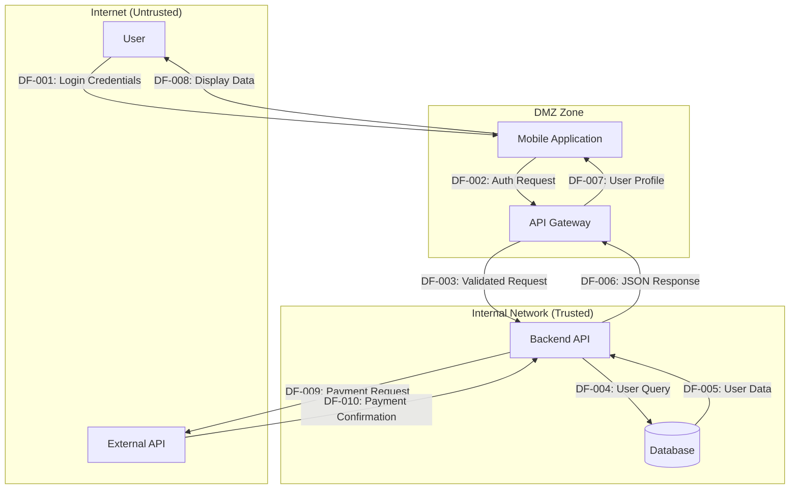

# Documentation Specialist: Stage 2 Guide | Output: 02-data-flow-analysis.md + DFDs (3 formats)

---

## Stage 2 Purpose

As the lead documentation specialist for Stage 2, your primary responsibility is **data flow identification, organization, and visualization**. You create the foundational data flow documentation that the threat-modeler will use in Stage 3 for security analysis.

**Your Mission:**
- Extract data flow information from documentation
- Map trust boundary crossings
- Create THREE equivalent Data Flow Diagrams
- Identify attack surface entry points
- Organize systematic data flow documentation

---

## Context Requirements for This Stage

### **REQUIRED Files (Must Load):**
- `documentation-specialist/role-reminder.md` - Your role definition (worker mode, no fabrication)
- `documentation-specialist/stage-2-guide.md` - This file
- `shared/core-terms.md` - Data Flow, Trust Boundary, External Entity definitions
- `shared/confidence-calibration.md` - Confidence level framework
- `shared/output-file-requirements.md` - Output format specifications

### **REQUIRED Inputs (From Previous Stages):**
- `01-system-understanding.md` - Component inventory, trust boundaries, data assets from Stage 1

### **OPTIONAL Files (Load if Needed):**
- `.ai-instructions/threat-modeling/stage-2-dfd-requirements.md` - Detailed triple-format DFD specifications

### **NOT NEEDED (Can Unload):**
- `documentation-specialist/stage-1-guide.md` - Stage 1 work is complete
- Threat-modeler files (security analysis comes in Stage 3+)
- Framework files (STRIDE, ATT&CK, Kill Chain not needed yet)

### **Outputs for Next Stages:**
- `02-data-flow-analysis.md` - Comprehensive data flow documentation
- `02-data-flow-diagram.mermaid` - Mermaid format DFD
- `02-data-flow-diagram.drawio.xml` - Draw.io XML format DFD
- All three will be used by Stages 3-6

---

## CRITICAL REQUIREMENT: Triple-Format DFD

### **MANDATORY: Create THREE Equivalent Formats**

Stage 2 MUST produce three Data Flow Diagrams with **IDENTICAL content**:

1. **Text-Based Markdown DFD** (in `02-data-flow-analysis.md`)
2. **Mermaid Diagram** (`02-data-flow-diagram.mermaid`)
3. **Draw.io XML** (`02-data-flow-diagram.drawio.xml`)

### **Content Equivalency Requirement**

**ALL three formats MUST contain:**
- Same number of data flows
- Identical component names (from Stage 1)
- Same trust boundaries (from Stage 1)
- Same data elements per flow
- Consistent flow numbering (DF-001, DF-002, etc.)

**Validation:** Count flows in each format → numbers must match exactly

---

## Step-by-Step Workflow

### **Step 1: Review Stage 1 Outputs**

**Action:** Load and review Stage 1 system understanding deliverable

**Extract From Stage 1:**
- Component inventory (use exact component names)
- Trust boundary definitions (use exact boundary names)
- Data asset catalog (reference for data elements)
- Source documentation references

**Create Reference Lists:**
```markdown
## Stage 1 References

### Components (from Stage 1)
1. [Component 1 Name]
2. [Component 2 Name]
3. [Component 3 Name]
[etc.]

### Trust Boundaries (from Stage 1)
1. [Boundary 1 Name]: [Components it separates]
2. [Boundary 2 Name]: [Components it separates]
[etc.]

### Data Assets (from Stage 1)
1. [Data Asset 1]: [Description]
2. [Data Asset 2]: [Description]
[etc.]
```

**CRITICAL:** Use Stage 1 component and boundary names EXACTLY - no variations

---

### **Step 2: Data Flow Identification**

**Action:** Read documentation to identify how components interact

**Look For in Documentation:**
- API calls between components
- Database queries and responses
- Message queue publications/subscriptions
- File transfers or storage operations
- User interactions (input/output)
- External service integrations
- Authentication flows
- Configuration data flows

**Data Flow Numbering System:**
- Use sequential numbering: DF-001, DF-002, DF-003, etc.
- Maintain consistent numbering across all three formats
- Use same numbers in markdown, Mermaid, and Draw.io

**For Each Data Flow Extract:**
- **Source component** (must be from Stage 1 inventory)
- **Destination component** (must be from Stage 1 inventory)
- **Data elements transmitted** (reference Stage 1 data assets)
- **Communication protocol** (if documented)
- **Trust boundary crossed** (if applicable, from Stage 1)
- **Security considerations** (preliminary observations)

---

### **Step 3: Create Text-Based Markdown DFD**

**Action:** Document all flows in structured markdown table format

**Primary DFD Table:**
```markdown
## Data Flow Inventory

| Flow ID | Source Component | Destination Component | Data Elements | Protocol | Trust Boundary | Auth Required |
|---------|------------------|----------------------|---------------|----------|----------------|---------------|
| DF-001  | [Source]         | [Destination]        | [Elements]    | [Proto]  | [Boundary]     | [Yes/No/Unk]  |
| DF-002  | [Source]         | [Destination]        | [Elements]    | [Proto]  | [Boundary]     | [Yes/No/Unk]  |
[Continue for all flows]
```

**Detailed Flow Documentation:**
For each flow, provide comprehensive details:

```markdown
### DF-001: [Source Component] → [Destination Component]

**Flow Description:** [What this data flow represents]
**Source:** "[Documentation reference]" ([filename], line [number])

**Data Elements Transmitted:**
- **[Element 1]:** [Description]
  - **Source:** "[Where documented]" ([file], line [num])
  - **Sensitivity:** [From Stage 1 data asset classification]
- **[Element 2]:** [Description]
  - **Source:** "[Where documented]" ([file], line [num])
  - **Sensitivity:** [Classification]

**Communication Protocol:**
- **Documented Protocol:** [HTTP/HTTPS/WebSocket/gRPC/etc. if specified]
  - **Source:** "[Quote]" ([file], line [num])
- **Unknown Protocol:** [If not documented]
  - **Inference:** [Reasonable guess with basis, if any]
  - **Confidence:** [MEDIUM/LOW]

**Trust Boundary Crossing:**
- **Crosses Boundary:** [Yes/No]
- **Boundary Name:** [From Stage 1 if applicable]
- **From Zone:** [Trust zone description]
- **To Zone:** [Trust zone description]
- **Security Implication:** [What crossing means - preliminary observation]

**Authentication Requirements:**
- **Documented:** [What documentation says about auth]
  - **Source:** "[Quote]" ([file], line [num])
- **Unknown:** [If not documented]
  - **Assumption:** [If making assumption, mark clearly]
  - **Confidence:** [MEDIUM/LOW]

**Security Considerations:**
[Preliminary observations about security relevance]
- **Consideration 1:** [Observation based on data sensitivity]
- **Consideration 2:** [Observation based on trust boundary crossing]
- **Note:** Detailed threat analysis in Stage 3 by threat-modeler

**Confidence in Flow Documentation:**
- **Flow Existence:** [HIGH/MEDIUM/LOW] - [Justification]
- **Data Elements:** [HIGH/MEDIUM/LOW] - [Justification]
- **Protocol:** [HIGH/MEDIUM/LOW/INSUFFICIENT] - [Justification]
```

---

### **Step 4: Create Mermaid Diagram**

**Action:** Represent ALL flows from Step 3 in Mermaid graph format

**Mermaid DFD Structure:**



**Critical Requirements:**
- ✅ **Same flow numbers** as markdown table (DF-001, DF-002, etc.)
- ✅ **Exact component names** from Stage 1
- ✅ **All flows** from markdown must appear in Mermaid
- ✅ **Trust boundaries** shown as subgraphs
- ✅ **Flow labels** indicate data or purpose

**Verification:**
```
Markdown Table Flows: [Count]
Mermaid Diagram Flows: [Count]
MUST MATCH ✓
```

**Save as:** `02-data-flow-diagram.mermaid`

---

### **Step 5: Create Draw.io XML Diagram**

**Action:** Represent ALL flows from Step 3 in Draw.io XML format

**Draw.io XML Structure:**

```xml
<mxfile host="app.diagrams.net" modified="2025-11-07T00:00:00.000Z" agent="Documentation Specialist" version="21.0.0">
  <diagram name="Data Flow Diagram" id="data-flow-diagram">
    <mxGraphModel dx="1422" dy="794" grid="1" gridSize="10" guides="1" tooltips="1" connect="1" arrows="1" fold="1" page="1" pageScale="1" pageWidth="1169" pageHeight="827">
      <root>
        <mxCell id="0"/>
        <mxCell id="1" parent="0"/>
        
        <!-- External Entities (Rectangles) -->
        <mxCell id="user" value="User" style="rounded=0;whiteSpace=wrap;html=1;" vertex="1" parent="1">
          <mxGeometry x="100" y="100" width="120" height="60" as="geometry"/>
        </mxCell>
        
        <!-- System Components (Rounded Rectangles) -->
        <mxCell id="mobile-app" value="Mobile Application" style="rounded=1;whiteSpace=wrap;html=1;" vertex="1" parent="1">
          <mxGeometry x="300" y="100" width="120" height="60" as="geometry"/>
        </mxCell>
        
        <mxCell id="api-gateway" value="API Gateway" style="rounded=1;whiteSpace=wrap;html=1;" vertex="1" parent="1">
          <mxGeometry x="500" y="100" width="120" height="60" as="geometry"/>
        </mxCell>
        
        <mxCell id="backend-api" value="Backend API" style="rounded=1;whiteSpace=wrap;html=1;" vertex="1" parent="1">
          <mxGeometry x="700" y="100" width="120" height="60" as="geometry"/>
        </mxCell>
        
        <!-- Data Stores (Cylinders) -->
        <mxCell id="database" value="Database" style="shape=cylinder;whiteSpace=wrap;html=1;boundedLbl=1;backgroundOutline=1;" vertex="1" parent="1">
          <mxGeometry x="900" y="100" width="80" height="80" as="geometry"/>
        </mxCell>
        
        <!-- Trust Boundaries (Dashed Rectangles) -->
        <mxCell id="internet-boundary" value="Internet (Untrusted)" style="rounded=0;whiteSpace=wrap;html=1;dashed=1;dashPattern=5 5;" vertex="1" parent="1">
          <mxGeometry x="80" y="50" width="180" height="140" as="geometry"/>
        </mxCell>
        
        <mxCell id="internal-boundary" value="Internal Network (Trusted)" style="rounded=0;whiteSpace=wrap;html=1;dashed=1;dashPattern=5 5;" vertex="1" parent="1">
          <mxGeometry x="680" y="50" width="320" height="140" as="geometry"/>
        </mxCell>
        
        <!-- Data Flows (Arrows with Labels) -->
        <mxCell id="flow-df001" value="DF-001: Login Credentials" style="edgeStyle=orthogonalEdgeStyle;rounded=0;orthogonalLoop=1;jettySize=auto;html=1;exitX=1;exitY=0.5;entryX=0;entryY=0.5;" edge="1" parent="1" source="user" target="mobile-app">
          <mxGeometry relative="1" as="geometry"/>
        </mxCell>
        
        <mxCell id="flow-df002" value="DF-002: Auth Request" style="edgeStyle=orthogonalEdgeStyle;rounded=0;orthogonalLoop=1;jettySize=auto;html=1;" edge="1" parent="1" source="mobile-app" target="api-gateway">
          <mxGeometry relative="1" as="geometry"/>
        </mxCell>
        
        <!-- Continue for all flows... -->
        
      </root>
    </mxGraphModel>
  </diagram>
</mxfile>
```

**Critical Requirements:**
- ✅ **Same flow numbers** as markdown and Mermaid (DF-001, DF-002, etc.)
- ✅ **Exact component names** from Stage 1
- ✅ **All flows** from markdown must appear in Draw.io
- ✅ **Trust boundaries** shown as dashed containers
- ✅ **Professional layout** (readable, organized)

**Component Shapes:**
- External entities: Rectangles
- System processes: Rounded rectangles
- Data stores: Cylinders
- Trust boundaries: Dashed rectangles (containers)

**Verification:**
```
Markdown Table Flows: [Count]
Draw.io XML Flows: [Count]
MUST MATCH ✓
```

**Save as:** `02-data-flow-diagram.drawio.xml`

---

### **Step 6: Verify Content Equivalency**

**Action:** Systematically verify all three formats contain identical information

**Equivalency Checklist:**

```markdown
## Triple-Format Equivalency Verification

### Flow Count Verification
- **Markdown Table:** [N] flows
- **Mermaid Diagram:** [N] flows
- **Draw.io XML:** [N] flows
- **Status:** [✓ MATCH / ✗ MISMATCH]

### Component Coverage
- **Components in Stage 1:** [List]
- **Components in Markdown:** [List]
- **Components in Mermaid:** [List]
- **Components in Draw.io:** [List]
- **Status:** [✓ ALL MATCH / ✗ DISCREPANCIES FOUND]

### Trust Boundary Coverage
- **Boundaries from Stage 1:** [List]
- **Boundaries in Markdown:** [List]
- **Boundaries in Mermaid:** [List with subgraph names]
- **Boundaries in Draw.io:** [List with container IDs]
- **Status:** [✓ ALL MATCH / ✗ DISCREPANCIES FOUND]

### Spot-Check Verification (Sample 5-10 Flows)
**DF-001:**
- Markdown: [Source] → [Dest] ✓
- Mermaid: [Source] → [Dest] ✓
- Draw.io: [Source] → [Dest] ✓

**DF-002:**
- Markdown: [Source] → [Dest] ✓
- Mermaid: [Source] → [Dest] ✓
- Draw.io: [Source] → [Dest] ✓

[Continue spot-checking]

### Equivalency Confirmation
- [ ] All three formats created
- [ ] Flow counts match exactly
- [ ] Component names identical across formats
- [ ] Trust boundaries consistent
- [ ] Spot-check passed
- [ ] **EQUIVALENCY VERIFIED ✓**
```

**If Mismatches Found:** Fix before proceeding

---

### **Step 7: Attack Surface Mapping**

**Action:** Identify and document external entry points

**Attack Surface Entry Point Types:**
- Public-facing web interfaces
- Mobile application interfaces
- Public API endpoints
- Administrative interfaces
- File upload mechanisms
- External integration points

**For Each Entry Point:**
```markdown
### Attack Surface Entry Point: [Entry Point Name]
**Type:** [Web Interface/Mobile App/API Endpoint/Admin Portal/File Upload/etc.]
**Source:** "[Documentation reference]" ([file], line [num])

**Associated Components:**
- **Primary Component:** [From Stage 1 inventory]
- **Supporting Components:** [List if applicable]

**Trust Boundary Crossed:**
- **Boundary Name:** [From Stage 1]
- **From Zone:** [External/Untrusted zone]
- **To Zone:** [Internal/Trusted zone]

**Authentication Requirements:**
- **Documented:** [What documentation says]
  - **Source:** "[Quote]" ([file], line [num])
- **Unknown:** [If not documented]
  - **Confidence:** [MEDIUM/LOW]

**Input Validation:**
- **Documented Approach:** [If validation documented]
  - **Source:** "[Quote]" ([file], line [num])
- **Unknown:** [If not documented - flag for Stage 3]

**Data Flows Involved:**
[List all DF-XXX flows using this entry point]
- **DF-001:** [Brief description]
- **DF-005:** [Brief description]

**Preliminary Security Considerations:**
[Observations about this attack surface element]
- **Public Exposure:** [Degree of external accessibility]
- **Data Sensitivity:** [Based on flows and data elements]
- **Trust Transition:** [Significance of boundary crossing]
- **Note:** Detailed threat analysis in Stage 3
```

---

### **Step 8: Data Flow Analysis Narrative**

**Action:** Create comprehensive narrative describing data flows

```markdown
## Data Flow Analysis Narrative

### System Data Flow Overview
[High-level description of how data moves through the system]

**Primary Data Flow Patterns:**
1. **[Pattern Name]:** [Description]
   - **Involved Flows:** DF-XXX, DF-XXX, DF-XXX
   - **Purpose:** [What this pattern accomplishes]
   - **Trust Boundaries:** [Which boundaries involved]

2. **[Pattern Name]:** [Description]
   - **Involved Flows:** DF-XXX, DF-XXX
   - **Purpose:** [What this pattern accomplishes]
   - **Trust Boundaries:** [Which boundaries involved]

### Critical Data Paths
[Identify most security-relevant paths]

**Path 1: [Name - e.g., "User Authentication Flow"]**
- **Flows:** DF-XXX → DF-XXX → DF-XXX
- **Components:** [List in order]
- **Data:** [What data flows through this path]
- **Trust Boundaries Crossed:** [N] boundaries
- **Security Significance:** [Why this path is critical]

**Path 2: [Name - e.g., "Payment Processing Flow"]**
[Same pattern]

### External Dependencies
[Document data flows to/from external systems]

**External System 1: [Name]**
- **Flows:** DF-XXX (outbound), DF-XXX (inbound)
- **Data Exchanged:** [Description]
- **Trust Relationship:** [How external system trusted]
- **Security Considerations:** [Preliminary observations]

### Data Flow Complexity Assessment
- **Total Data Flows:** [N]
- **Internal Flows:** [N] (within trust zones)
- **Trust Boundary Crossings:** [N]
- **External Integrations:** [N]
- **Complexity Rating:** [LOW/MEDIUM/HIGH]
- **Rationale:** [Why this complexity rating]
```

---

### **Step 9: Confidence Assessment**

**Action:** Assess confidence in data flow documentation

```markdown
## Stage 2 Confidence Assessment

### Overall Data Flow Documentation Confidence: [HIGH/MEDIUM/LOW]

**Confidence Breakdown:**

#### Data Flow Identification: [HIGH/MEDIUM/LOW]
- **Well-Documented Flows:** [N] flows with explicit documentation
- **Inferred Flows:** [N] flows based on component relationships
- **Speculative Flows:** [N] flows with low confidence
- **Rationale:** [Explanation of overall confidence]

#### Protocol Documentation: [HIGH/MEDIUM/LOW/INSUFFICIENT]
- **Explicit Protocols:** [N] flows with documented protocols
- **Unknown Protocols:** [N] flows without protocol information
- **Impact:** [How protocol gaps affect analysis]

#### Trust Boundary Mapping: [HIGH/MEDIUM/LOW]
- **Clear Boundary Crossings:** [N] flows
- **Ambiguous Crossings:** [N] flows
- **Rationale:** [Explanation]

#### Attack Surface Coverage: [HIGH/MEDIUM/LOW]
- **Documented Entry Points:** [N] points
- **Likely Additional Entry Points:** [N] inferred
- **Rationale:** [Explanation]

### Limitations and Gaps
1. **[Limitation 1]:** [Description and impact]
2. **[Limitation 2]:** [Description and impact]
3. **[Limitation 3]:** [Description and impact]

### Recommendations for Stage 3
[Guidance for threat-modeler based on documentation quality]
- **Well-Documented Areas:** [Where detailed threat analysis possible]
- **Generic Approach Needed:** [Where insufficient detail requires generic threats]
- **Critical Follow-Up:** [Information to seek in Collaborative mode]
```

---

### **Step 10: Output File Compilation**

**Action:** Create final `02-data-flow-analysis.md` deliverable

**Required Structure:**
```markdown
# Stage 2: Data Flow Analysis
**Target System:** [System Name]
**Analysis Date:** [YYYY-MM-DD]
**Operational Mode:** [Collaborative/Automatic]
**Documentation Specialist:** Stage 2 Lead

## 1. Executive Summary
[1-2 paragraph overview of data flow analysis findings]

## 2. Data Flow Inventory Table
[Comprehensive table with all flows]

## 3. Detailed Data Flow Documentation
[Complete DF-001 through DF-XXX documentation]

## 4. Trust Boundary Analysis
[Analysis of boundary crossings and implications]

## 5. Attack Surface Mapping
[Complete attack surface documentation]

## 6. Data Flow Patterns and Critical Paths
[Narrative analysis of flow patterns]

## 7. External Dependencies
[Documentation of external system interactions]

## 8. Triple-Format DFD Verification
[Equivalency verification results]

## 9. Confidence Assessment
[Complete confidence analysis]

## 10. Stage 1 Cross-References
[References back to Stage 1 components, boundaries, data assets]

## 11. Source Documentation References
[Bibliography of all sources used]

## Appendices
- Appendix A: Data Flow Diagram (Mermaid) - See separate file
- Appendix B: Data Flow Diagram (Draw.io XML) - See separate file
```

---

## Quality Checklist

Before considering Stage 2 complete, verify:

- [ ] **Three DFD files created** (markdown, mermaid, draw.io XML)
- [ ] **Content equivalency verified** (flow counts match)
- [ ] **All flows have source references**
- [ ] **Component names match Stage 1 exactly**
- [ ] **Trust boundary names match Stage 1 exactly**
- [ ] **No fabricated protocols or technical details**
- [ ] **Attack surface comprehensively mapped**
- [ ] **Confidence levels documented**
- [ ] **Professional formatting in all three formats**
- [ ] **Cross-references to Stage 1 accurate**

---

## Common Mistakes to Avoid

### ❌ Mistake 1: Missing DFD Format
```
WRONG: Only creating Mermaid diagram, skipping Draw.io XML
CORRECT: Create all three formats (markdown, mermaid, draw.io)
```

### ❌ Mistake 2: Inconsistent Flow Numbering
```
WRONG:
Markdown: DF-001, DF-002, DF-003
Mermaid: Flow1, Flow2, Flow3

CORRECT:
All formats use: DF-001, DF-002, DF-003
```

### ❌ Mistake 3: Content Mismatch
```
WRONG:
Markdown: 15 flows
Mermaid: 12 flows (missing 3)

CORRECT:
All formats: Exactly 15 flows
```

### ❌ Mistake 4: Fabricated Protocols
```
WRONG:
**Protocol:** HTTPS with TLS 1.3

CORRECT:
**Protocol:** 
- **Documented:** API examples show HTTPS
- **Source:** (api-spec.yaml, line 23)
- **TLS Version:** Not specified
- **Confidence:** MEDIUM (protocol documented, version unknown)
```

---

## Output Handoff

**After Stage 2 Complete:**
1. Save three files to target output directory:
   - `02-data-flow-analysis.md`
   - `02-data-flow-diagram.mermaid`
   - `02-data-flow-diagram.drawio.xml`
2. Verify content equivalency one final time
3. Signal work phase complete (do NOT proceed to validation)
4. Quality-critic will review for equivalency and data integrity
5. After critic approval, threat-modeler proceeds with Stage 3 threat identification

---

