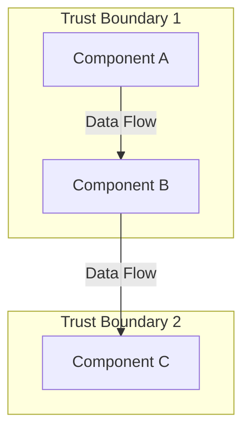

# Output File Requirements

**Purpose:** Standardized output file specifications for all threat modeling stages  
**Scope:** Universal file format, naming, and content requirements  

---

## CRITICAL REQUIREMENT: ALL STAGES MUST CREATE OUTPUT FILES

Every threat modeling stage must create one or more files in the target's output directory. This requirement is **MANDATORY** for all operational modes.

## Benefits of Output Files

Stage recovery, critic review separation, audit trail, incremental progress tracking, version control, reference material continuity, stakeholder communication

## Output File Naming Convention

**Format:** `[stage-number]-[stage-name].[extension]`

**Examples:**
- `01-system-understanding.md`
- `01_clarifying_questions.md` (Collaborative Mode only, if questions asked)
- `02-data-flow-analysis.md`
- `02-data-flow-diagram.mermaid`
- `02-data-flow-diagram.drawio.xml`
- `02_clarifying_questions.md` (Collaborative Mode only, if questions asked)
- `03-threat-identification.md`
- `04-risk-assessment.md`
- `05-mitigation-strategy.md`
- `06-final-comprehensive-report.md`

## Output File Location

**Standard Path:** `[target-directory]/output/threat-model/`

**Example:** `/targets/openssh/output/threat-model/01-system-understanding.md`

**Directory Creation:** Agent must create output directory structure if it doesn't exist

**Command Example:**
```bash
mkdir -p [target-directory]/output/threat-model/
```

## Output File Content Requirements

**Complete Analysis:** Full content (not summaries), sufficient detail, self-contained with cross-references

**Source References:** Specific quotes, document references (file/section/line), confidence levels

**Assumptions:** ⚠️ ASSUMPTION marking, confidence levels (HIGH/MEDIUM/LOW/INSUFFICIENT), impact if incorrect

**Formatting:** Professional markdown, clear headers, lists/tables/code blocks, consistent organization

**Self-Contained:** Independently comprehensible, cross-references where needed

## Stage-Specific Output Files

| Stage | Files | Required Content |
|-------|-------|------------------|
| **1: System Understanding** | `01-system-understanding.md`<br>`01_clarifying_questions.md`* | System description/business purpose, component inventory, trust boundaries, data assets, assumptions, scope<br>*Collaborative Mode only: Q&A log (see below) |
| **2: Data Flow Analysis** | `02-data-flow-analysis.md`<br>`02-data-flow-diagram.mermaid`<br>`02-data-flow-diagram.drawio.xml`<br>`02_clarifying_questions.md`* | Data flows (numbered), source/destination, data elements, trust boundary crossings, security considerations<br>**CRITICAL:** All 3 formats IDENTICAL content<br>*Collaborative Mode only: Q&A log (see below) |
| **3: Threat Identification** | `03-threat-identification.md`<br>`03_clarifying_questions.md`* | STRIDE threats per component, MITRE ATT&CK mappings, Kill Chain stages, attack scenarios, affected assets, preliminary risk ratings<br>*Collaborative Mode only: Q&A log (see below) |
| **4: Risk Assessment** | `04-risk-assessment.md`<br>`04_clarifying_questions.md`* | CVSS v4.0 (when data available), likelihood/business impact, risk matrix, confidence levels, data limitations<br>*Collaborative Mode only: Q&A log (see below) |
| **5: Mitigation Strategy** | `05-mitigation-strategy.md`<br>`05_clarifying_questions.md`* | Controls mapped to threats, implementation guidance, priority roadmap, feasibility assessment, residual risk, quick wins<br>*Collaborative Mode only: Q&A log (see below) |
| **6: Final Report** | `06-final-comprehensive-report.md`<br>`06_clarifying_questions.md`* | Executive summary (1-2 pages), service overview, architecture (with DFD), assumptions, ALL threats from Stage 3 (priority-sorted), recommendations, conclusion<br>*Collaborative Mode only: Q&A log (see below) |

**\*Clarifying Questions Files (Collaborative Mode Only):**
- **File Format:** `{stage-number}_clarifying_questions.md`
- **When Required:** Only in Collaborative Mode when clarifying questions are asked
- **Content Structure:**
  ```markdown
  # Stage [N] Clarifying Questions and Responses
  
  ## Question [Number] - [Brief Topic]
  
  **Context:** Why this information was needed
  
  **Question:**
  [Exact question text as asked to user]
  
  **User Response:**
  [Exact response text from user]
  
  **Timestamp:** [If available]
  
  **Incorporated Into Analysis:** [How/where this was used]
  
  ---
  ```
- **Update Pattern:** Append new Q&A pairs as they occur during stage work and iteration phases
- **Purpose:** Audit trail, data traceability, reproducibility, reference for later stages
- **Cross-Reference Requirement:** Main stage output files MUST reference the clarifying questions file when incorporating user-provided information
  - **Format:** `*Source: User clarification (see Question [N] in {stage-number}_clarifying_questions.md)*`
  - **Placement:** Inline with the analysis section that uses the user-provided information
  - **Example:** 
    ```markdown
    The system operates with a fleet of 5,000 bikes across 3 cities and uses dynamic pricing based on demand.
    *Source: User clarification (see Question 2 in 01_clarifying_questions.md)*
    ```
  - **Purpose:** Clear traceability distinguishing user-provided information from documented sources

## File Format Standards

### **Markdown (.md)**

**Headers:**
```markdown
# Main Title (H1)
## Major Section (H2)
### Subsection (H3)
#### Detail Section (H4)
```

**Lists:**
```markdown
- Unordered list item
  - Nested item
  - Another nested item

1. Ordered list item
2. Second item
```

**Tables:**
```markdown
| Column 1 | Column 2 | Column 3 |
|----------|----------|----------|
| Data     | Data     | Data     |
```

**Code Blocks:**
````markdown
```language
code content
```
````

**Emphasis:**
```markdown
*italic* or _italic_
**bold** or __bold__
***bold italic***
```

### **Mermaid (.mermaid)**

**Graph/Flowchart Syntax:**


**Requirements:**
- Valid Mermaid syntax (validate before saving)
- All components represented as nodes
- All data flows represented as edges
- Trust boundaries represented as subgraphs
- Labels for all flows and components

### **Draw.io XML (.drawio.xml)**

**Format:**
- Valid XML structure compatible with draw.io/diagrams.net
- Professional diagram layout
- Proper shapes for components (rectangles, cylinders)
- Connectors for data flows with labels
- Grouping/containers for trust boundaries

**Import Verification:**
- File must be importable into draw.io without errors
- Layout should be readable and professional
- All elements should be properly labeled

## Quality Standards for Output Files

**Completeness:** All sections present, no placeholders (TODO/TBD), sufficient detail

**Accuracy:** Verified source references, appropriate confidence levels, marked assumptions

**Consistency:** Terminology aligned with glossary, accurate cross-references, version consistency

**Professionalism:** Proper grammar/spelling, clear/concise language, executive tone, organized structure

## File Validation Checklist

Files in `[target]/output/threat-model/`, naming convention followed, required sections present, source references with quotes, assumptions with confidence levels, professional markdown, self-contained, accurate cross-references, **Stage 2:** all 3 DFD formats identical, **Stage 6:** ALL Stage 3 threats included

## Critic Validation of Output Files

File existence/location, naming compliance, content completeness, format validity (Mermaid/Draw.io), content equivalency (Stage 2: 3 DFDs identical), threat completeness (Stage 6: ALL Stage 3 threats), self-containment, professional quality

## Error Handling

**Directory Creation:** Verify path exists, check permissions, use absolute paths

**File Write:** Check disk space, validate filename (no special chars), check locks/permissions

**Format Validation:** Mermaid (use online validator), Draw.io XML (test import), Markdown (preview rendering)

---

**REMINDER: When modifying these requirements, ensure equivalent changes are made to ALL supported AI platform instruction sets to maintain cross-system ruleset consistency.**

