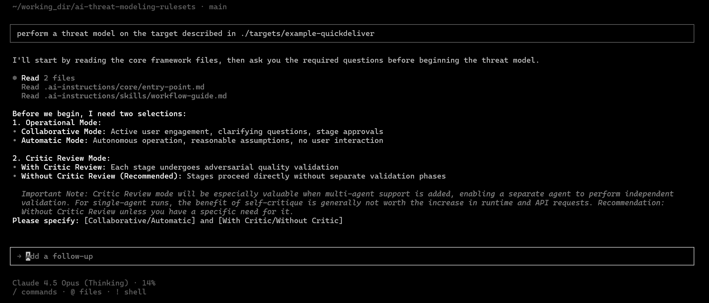

# AI-Assisted Threat Modeling Framework

A structured instruction set for guiding AI agents through comprehensive security threat modeling.

> **⚠️ AI Disclaimer:** AI outputs are NOT guaranteed to be accurate or complete. LLMs hallucinate and make errors. **All outputs MUST be reviewed by qualified security professionals.** This tool augments—not replaces—human expertise.

> **📋 Status:** Developed for **Cursor** with **Claude** models. Tested primarily in Automatic mode. Collaborative mode and diverse system types need further validation. The complete process is resource-intensive—premium AI plans recommended.

---

## Quick Start

1. **Clone** this repository
2. **Open** in Cursor (or compatible AI editor)
3. **Place target documentation** in `targets/[system-name]/external-resources/`
4. **Initiate** with: `"Perform a threat model on ./targets/[system-name]/"`
5. **Select options** when prompted (see below)

### Startup Selections

The agent will prompt you to select **both** operational mode and critic review preference before starting:



| Mode | Description |
|------|-------------|
| **Collaborative** | User answers questions, reviews/approves each stage |
| **Automatic** | Fully autonomous, uses provided documentation only |

| Critic Review | Description |
|---------------|-------------|
| **Without Critic** *(Recommended)* | Direct execution, 50-75% faster |
| **With Critic** | Adversarial validation after each stage (better suited for future multi-agent setups) |

---

## Methodology

### 6-Stage Process

| Stage | Output | Description |
|-------|--------|-------------|
| 1 | `01-system-understanding.md` | Architecture, components, trust boundaries |
| 2 | `02-data-flow-analysis.md` | DFDs, data flows, attack surfaces |
| 3 | `03-threat-identification.md` | STRIDE + MITRE ATT&CK + Kill Chain analysis |
| 4 | `04-risk-assessment.md` | Risk scoring and prioritization |
| 5 | `05-mitigation-strategy.md` | Security controls and roadmap |
| 6 | `00-final-report.md` | Executive-ready consolidated report |

### Key Principles

- **Evidence-based**: All claims traced to source documentation
- **Confidence-calibrated**: HIGH/MEDIUM/LOW/INSUFFICIENT levels
- **No fabrication**: Unknown details acknowledged, not invented
- **Multi-framework**: Integrates STRIDE, MITRE ATT&CK, and Cyber Kill Chain

---

## Repository Structure

```
.ai-instructions/           # Framework instructions
├── core/entry-point.md     # Central entry point
├── modes/                  # Collaborative & Automatic mode configs
└── skills/                 # Modular skills framework
    ├── workflow-guide.md
    ├── documentation-specialist/   # Stages 1, 2, 6
    ├── threat-modeler/             # Stages 3-6
    ├── quality-critic/             # Validation (optional)
    └── shared/                     # Terminology, confidence levels

targets/[system-name]/
├── external-resources/     # Place target documentation here
└── output/threat-model/    # Generated outputs
```

### Example Output

See `targets/example-quickdeliver/` for a complete example threat model output, including all 6 stages and supporting JSON working documents.

---

## Platform Support

| Platform | Loader File |
|----------|-------------|
| **Cursor** | `.cursorrules` (auto-loaded) |
| **GitHub Copilot** | `.github/copilot-instructions.md` |

---

## Known Limitations

- **Single-agent context sharing**: Critic retains worker context, reducing validation effectiveness
- **Numeric anchoring**: Agent may hit suggested ranges in instructions

---

## Potential Improvements

- Multi-agent architecture for true worker/critic separation
- Improved Data-Flow Diagram generation
- Final report formatting refinements
- Remove numeric anchors from instructions

---

## Related Resources

- [STRIDE](https://learn.microsoft.com/en-us/azure/security/develop/threat-modeling-tool-threats) - Microsoft threat classification
- [MITRE ATT&CK](https://attack.mitre.org/) - Adversary tactics knowledge base
- [Cyber Kill Chain](https://www.lockheedmartin.com/en-us/capabilities/cyber/cyber-kill-chain.html) - Attack progression framework

---

## License

MIT License - See [LICENSE](LICENSE) for details.

**Created by:** Mike Ensing (ensingm2@gmail.com)

---

*This framework augments human security expertise but does not replace it. Always apply critical thinking to AI-generated threat models.*
